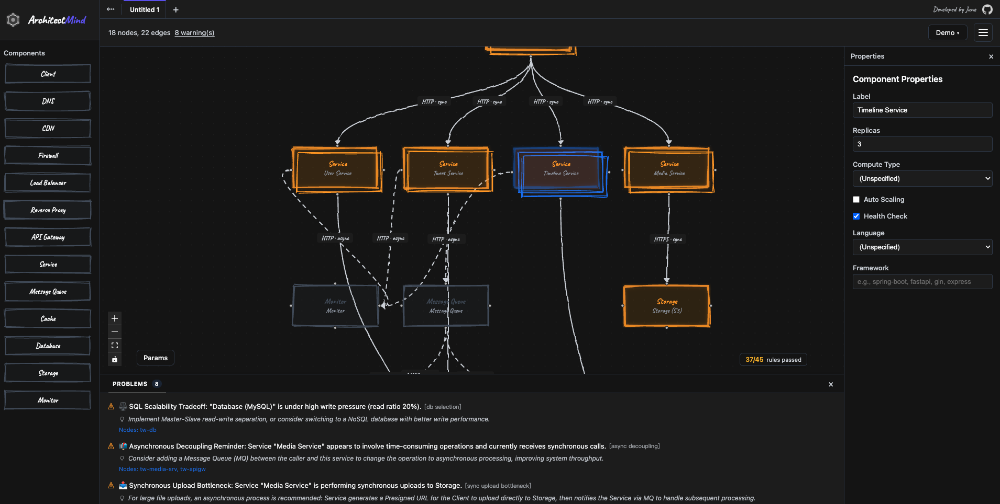

# ArchitectMind: System Design Visualizer

[🌐 Live Demo](https://architect-mind.vercel.app/)



ArchitectMind is a web-based tool for visualizing and analyzing system architectures. It provides an intuitive interactive canvas where users can drag and drop infrastructure components (such as Load Balancers, Databases, Services, etc.) and receive architectural logic validation and best practice recommendations via a backend API.

## 🚀 Features

- **Interactive Canvas**: Based on React Flow v12, supports node drag-and-drop, connections, and custom properties.
- **Component Sidebar**: A standard library of 13 system design components (Client, DNS, CDN, Firewall, Load Balancer, Reverse Proxy, API Gateway, Service, Message Queue, Cache, Database, Storage, Monitor). Collapsible with `⌘/Ctrl + B`.
- **Real-time Architecture Validation**: Analysis runs automatically (debounced) whenever the topology or system parameters change — no manual trigger needed. 45 automated rules check whether component types and connection logic align with system design best practices, with a live `N/45 rules passed` indicator.
- **Custom Analysis Parameters**: Set system parameters like DAU, QPS, Storage, and Availability targets in the draggable/resizable **Params** panel to generate more precise capacity planning recommendations.
- **Multi-tab Support**: Open multiple design canvases simultaneously for architecture comparison and multi-project workflows.
- **One-click Presets**: Classic system design templates (Basic, Twitter, YouTube, Google) to help you get started quickly.
- **Export Capabilities**: Supports exporting to Excalidraw, PNG, Mermaid, and PDF formats.
- **Quick Operations**: **Duplicate** (Shift + drag), **Merge/Split** of role-based nodes, **Undo/Redo**, **Copy/Paste**, and **Select All**.
- **Multi-theme Support**: 5 themes available - Light, Dark, Warm, Dream, and CyberPunk to suit different visual preferences.
- **Responsive Design**: Clean and modern user interface.

### ⌨️ Keyboard Shortcuts

| Shortcut | Action |
|----------|--------|
| `⌘/Ctrl + B` | Toggle component sidebar |
| `⌘/Ctrl + A` | Select all nodes and edges |
| `⌘/Ctrl + C` / `⌘/Ctrl + V` | Copy / Paste selection |
| `⌘/Ctrl + Z` | Undo |
| `⌘/Ctrl + Shift + Z` | Redo |
| `Ctrl + M` | Merge two selected nodes |
| `Shift + drag` | Duplicate selection |

## 🛠 Tech Stack

### Frontend

- **React 19** + **TypeScript**
- **Vite** (Build tool)
- **React Flow (@xyflow/react v12)** (Canvas engine)

### Backend

- **Go 1.25+**
- **Gin Web Framework** (API routing)
- **Vercel Serverless Functions** (Production deployment)

## 📦 Installation and Setup

### 1. Quick Start

A convenience script is provided in the root directory to start both the backend and frontend development servers:

```bash
chmod +x start-dev.sh
./start-dev.sh
```

After starting:

- Frontend: `http://localhost:5173`
- Backend: `http://localhost:8080`

## ✅ Tests

Tests are currently focused on the backend. Run them in the root directory:

```bash
go test ./... -v
```

## 🔍 Validation Rule Examples

The backend implements 45 [Architecture Validation Rules](./docs/RULES.md), covering:

- **Availability**: Single Point of Failure (SPOF) checks, LB/Reverse Proxy redundancy validation, Health Check and auto-scaling configuration.
- **Performance**: Read/Write separation suggestions, Cache consistency and eviction policies, CDN global acceleration recommendations.
- **Security**: `invalid_connection` (detecting unreasonable component connection directions, such as DB→Client, LB→Database, DNS→Service, etc.), Firewall/WAF missing checks.
- **Scalability**: Asynchronous decoupling (MQ), traffic peak shaving suggestions, database vertical partitioning reminders.
- **Observability**: Logger/Monitor missing checks, Alerting configuration validation.
- **Capacity Planning**: Rules triggered by the system parameters you set (high QPS without cache, high DAU without CDN, insufficient replicas for the availability target, etc.).

## 🗺️ Roadmap

- [ ] **Infrastructure as Code (IaC) Integration**: Connect with tools like Terraform to generate deployment scripts directly from architecture diagrams.
- [ ] **AI Deployment Prompt Export**: Export system designs as specialized AI Prompts to help non-technical users quickly understand and implement deployments using AI tools (e.g., ChatGPT, Claude).

## 📂 Project Structure

- `/frontend`: React source code, React Flow components, custom hooks, and API logic.
- `/logic`: Validation engine — one `check_*.go` per rule category, plus the `/api/topology` request handler.
- `/model`: Topology, component property, and protocol data models.
- `/_cmd`: Local development server entry point (`go run _cmd/main.go`, port 8080).
- `/api`: Vercel serverless function entry point.
- `/docs`: [Full rule index](./docs/RULES.md).
